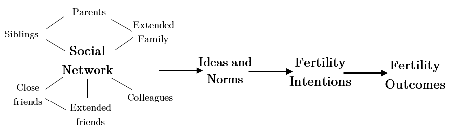

# Analytical Strategy {#Analytical}
Socio-demographic characterises are paramount in the pre-emptive and time-specific intention to have a child, as well as the ability to meet these intentions [@schoen1999b]. Constraints to achieving fertility goals are largely measurable through the use of socio-demographic individual and couple-level characteristics. Grand fertility differentials within England and Wales do not occur in a generalisable North versus South or East versus West duality as in Italy or Germany. This grand view hides the largest differentials that lie within the region at the very-small scale, defined here as below the Local Authority level. As the previous section analysed the main authors and ideas, this section analyses the existence of variable-specific fertility relationships. In doing so, this section is structured first by an exploration of individual-level fertility determinants. The second section will analyse neighbourhood measures of fertility, building upon the individual-level data. The third and final section will discuss spatial influence and how this can be measured.

## Composition effects
**Age**: Age determines childbearing biologically and also in relation to the influence of socio-demographics, with the mean age of childbearing increasing within England and Wales from a low of 26.4 in 1973 to 30.5 in 2017 (ONS, 2019). The postponement of childbearing led to a temporary decrease in TFR in the late 1990s and early 2000s, yet this effect in TFR ended around 2010 with tempo-adjusted TFR showing a gradual and non-extreme decline in European fertility, largely recovering from the postponement effects by 2007 [@goldstein2013]. Therefore, the influence of postponement and transitioning age of first birth are not expected to have a large impact on fertility, although this may differ by locality. The presence of postponement varies by socio-economic background, however, with education being directly linked to postponement  [@blossfeld1991;@nibhrolchain2012]. Postponement is not included in the model explicitly, but is likely to be captured by the measurement of TFR itself as well as proxy determinants of postponement, namely education. 

**Education**: Education is sometimes considered a central demographic determinant after age and sex [@lutz2011]. Recently, the cohort fertility behaviours of Generation Xers (born mid-1960s to early 1980s) have shown a marked increase in the fertility of women of university-level education in the United States [@zang2019]. The Nordic countries also display a lessening of the negative education-fertility outcomes, with those more socially disadvantaged being childless in higher proportions [@jalovaara2019]. The negative association between education and fertility may be lessening in certain sub-groups and contexts, however, the fertility outcomes of British university-educated women is below replacement level and below that of non-university educated women [@wood2014; @testa2014]; by age 46 there is a strong negative association between education and reaching stated fertility intentions [@berrington2014]. Education may also be viewed as interacting with contextual norms, in that highly-educated groups benefit disproportionately from work-family reconciliation programmes as well as in geographic areas where combining work and life is the norm [@wood2020]. The pattern in the UK still clearly displays lower fertility for those who have higher education, while education may also host broad contextual effects, therefore, a negative association is expected, countered by potential contextual effects leading to increased fertility.  

**Income**: The role of wealth on fertility, most frequently measured with GDP per capita, has changed in previous decades; as GDP per capita is now positively associated with TFR in high-income settings such as the EU [@myrskyla2011a;@fox2019]. Macro-level research is on the regional and national scale, with high- and low-fertility contexts pinpointed such as wealthy Northern Europe and austerity-hit Southern Europe, however, the within-country differences are expected to be stark and not as closely linked to the positive association seen on a continental scale. Income may reduce the perceived costs of childbearing, allowing work and family life to be combined. However, in a high-income household, the loss of work to care for a child results in a relatively large monetary loss. The cost-benefit analysis may therefore be influenced by local geography as employment conflicts more so with childbearing in contexts that are less gender-egalitarian. Collinearity may also influence results, that is, the concentration of highly-educated individuals creates concentrated economically advanced areas [@fox2019]. The sub-regional relationship between income and fertility is expected to be negative, even though the UK is within a high-fertility and high-income setting when viewed from in the European, national context. 

**Ethnicity**: The fertility of immigrants is generally higher than non-immigrant fertility, although the two become similar over time [@dubuc2012]. A more appropriate approach than measuring international migration is by measuring proportion of certain high fertility ethnic groups within the population. From 2000 to 2006 using the Labour Force Survey, @dubuc2009 estimated the white British female population to have a TFR of 1.73, similar to White Other, Black Caribbean and Indian populations, with Chinese women having very-low TFR (1.20). Black African, Pakistani and Bangladeshi female populations hosted TFRs above replacement level (2.40, 2.85, and 3.12 respectively). Dubuc also note religious differences within the Indian ethnicity, with Muslims hosting higher TFR than Hindus, and Sikhs less so than Hindus. These findings relate to TFR, but cohort fertility rates also show significant differences between the immigrants and native-born populations [@wilson2020]. An interesting outcome may result from the migrants normally migrating to wealthy areas, and low-fertility contexts [@billari2012]. The neighbourhood scale may capture the low-level differences, such as an immigrant enclave within a wealthy Local Authority. In line with Dubuc’s findings, high proportions of women in the Black African, Pakistani and Bangladeshi ethnic groups are expected to lead to higher TFR. 

## Contextual effects
**Population density**: The urban-rural simplified dichotomy is proven to be significant in most countries, and here, population density is used as a proxy for the urbanisation of a neighbourhood. The UK is not isolated in hosting higher fertility in less populated areas as shown by @fiori2014, but also in high-income countries such as the Netherlands [@debeer2007]. When controlling for women’s individual characteristics, @gray2018 find that women in small Australian towns are more likely to have a first child and continue to higher parities than those who live in high density cities. @fiori2014 identify “residential sorting” of individuals based on life course intentions such as starting a family. Self-selection effects are therefore present, as those with high fertility intentions migrate to town and city suburbs in order to have children, resulting in lower fertility in high population density contexts [@kulu2009]. From a life course approach, people move house and neighbourhood in order to have a child or soon after the birth of a first child, although the dichotomy is not so simple, with frequency of moves and motivations differing [@fiori2014]. In sum, less-densely populated areas are expected to host greater fertility when accounting for other variables. 

**Divorce**: Divorce is intended to display liberal attitudes towards marriage as well as high fertility. The relationship is complex, as if high divorce rates are accompanied by high cohabiting relationship dissolution, then fertility is expected to fall [@sigle-rushton2008]. This is in line with the SDT and decline of marriage as an institution. However, divorce may lead to an uptake in fertility rates if fertility intentions are revised by remarriage [@jefferies2000]. That is, the divorce rate captures in part a remarriage effect, whereby new partnerships are likely to have another child in a new relationship [@buber2000;@prskawetz2003]. Therefore, areas with high proportions of divorced individuals are expected to host higher levels of fertility. 

**Social support**: The UK welfare system is based on a 'means-tested approach', with some aspects of 'universalistic' support, but support is directed to disadvantaged groups such as single parents [@rendall2009]. The UK government is not pro-natalist in the policy approach to family formation, however, the welfare state and family support is focussed on those who are less wealthy, therefore, social housing may display those who benefit from welfare support. Given social change and political stability, the fertility of England and Wales is higher than expected under a disproportionate welfare regime when compared to other European countries [@sigle-rushton2008]. The lack of state intervention disproportionately benefits those with child-friendly careers and those most in need, leading to a polarisation within socio-economics based on education and profession [@ekert-jaffe2002]. As the welfare system does not differ between MSOAs, the prevalence of social housing is used to capture the disproportionate effect of welfare on those in most need and receiving a disproportionate boost to TFR, therefore, social housing is expected to be positively correlated with fertility.

**Religion**: Religion is considered here as a contextual variable, relating to the secularisation of a neighbourhood. Within the UK, the differences within ethnic groups by religion is significant [@dubuc2009], however, the majority of the population does not seem to be influenced by religion in fertility-decision-making processes. Religious differentials in TFR are expected to be partly covered by the ethnicity variables, while non-religious prevalence may capture the secular attitudes of a neighbourhood. Therefore, the proportion of the population who are non-religious is expected to be associated with lower TFR, linked to SDT ideas of individualism as well as high-fertility religious groups. 

## Neighbourhood effects 
Within countries, there are vast differences in the effects of variables such as divorce, urbanisation and income, with @jemna2018 displaying large differences among regions through the use of region-specific fixed effects. The linear models will therefore be somewhat limited in addressing regional differences, however, the spatial elements may account for this. In formalising the inclusion of a spatial element through spatially lagged TFR, the importance of proximity and neighbourhood assumes that neighbours should share similar learning processes as well as manners in which ideas are exchanged [@jung2019]. Networks transverse MSOA boundaries, whereas at a larger national or regional scale, the case for this is less so as a greater proportion of network interactions occur within the region and not over boundaries. Alongside the compositional and contextual variables above, queen-based contingency weights will be used to include spatial autocorrelation into the models, as well as spatially lagged explanatory variables in the Spatial Durbin Model. The models containing spatial interactions in error are less theoretically based in network analysis, and are not as useful for this type of analysis. Figure 2.1 displays the process of social networks, all the while occurring between MSOAs. 

```{r figure1, warnings=FALSE, messages=FALSE, fig.cap="Social Network Processes.", out.width = "95%", echo=FALSE, warning=FALSE}
# All defaults
library(knitr)    # For knitting document and include_graphics
library(captioner)
library(ggplot2)  # For plotting
library(png)

```

Social contagion relies on explicit social networks and the strength of social networks. @granovetter1973 state the strength of a tie between individuals to be a combination of time, emotional intimacy and reciprocal services. When measured, the size of social networks occur in a U-shaped curve over the life course; being low in young adulthood and peaking around 40 years of age, and then declining particularly after retirement ages [@micheli2000]. The definition of a social network’s size and composition depends on many variables, with the literature compounding age, marital status, employment status, education and gender as influencers [@diaz2011]. Along with individual characteristics, social contagion moderates childbearing intentions and are included as an aggregate process in the neighbourhood-scale models. That is, first-order queen neighbourhood matrices based on contagion match the contagion effects of social networks.
