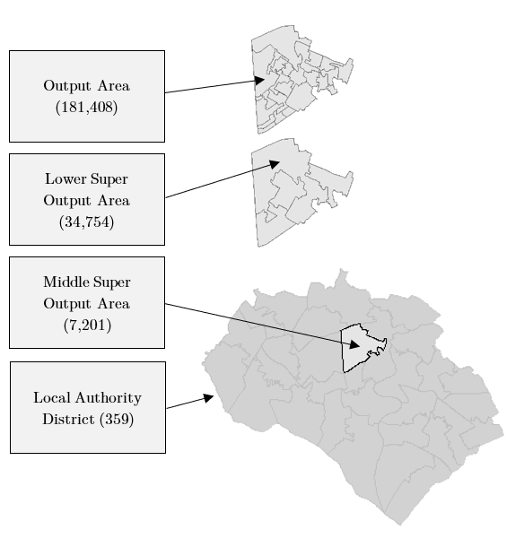

```{r include_packages_3, include = FALSE}
# This chunk ensures that the thesisdown package is
# installed and loaded. This thesisdown package includes
# the template files for the thesis and also two functions
# used for labeling and referencing
if (!require(remotes)) {
  if (params$`Install needed packages for {thesisdown}`) {
    install.packages("remotes", repos = "https://cran.rstudio.com")
  } else {
    stop(
      paste(
        'You need to run install.packages("remotes")',
        "first in the Console."
      )
    )
  }
}
if (!require(dplyr)) {
  if (params$`Install needed packages for {thesisdown}`) {
    install.packages("dplyr", repos = "https://cran.rstudio.com")
  } else {
    stop(
      paste(
        'You need to run install.packages("dplyr")',
        "first in the Console."
      )
    )
  }
}
if (!require(ggplot2)) {
  if (params$`Install needed packages for {thesisdown}`) {
    install.packages("ggplot2", repos = "https://cran.rstudio.com")
  } else {
    stop(
      paste(
        'You need to run install.packages("ggplot2")',
        "first in the Console."
      )
    )
  }
}
if (!require(bookdown)) {
  if (params$`Install needed packages for {thesisdown}`) {
    install.packages("bookdown", repos = "https://cran.rstudio.com")
  } else {
    stop(
      paste(
        'You need to run install.packages("bookdown")',
        "first in the Console."
      )
    )
  }
}
if (!require(thesisdown)) {
  if (params$`Install needed packages for {thesisdown}`) {
    remotes::install_github("ismayc/thesisdown")
  } else {
    stop(
      paste(
        "You need to run",
        'remotes::install_github("ismayc/thesisdown")',
        "first in the Console."
      )
    )
  }
}
library(thesisdown)
library(dplyr)
library(ggplot2)
library(knitr)
flights <- read.csv("data/flights.csv", stringsAsFactors = FALSE)
library(kableExtra)
```


# Data {#Data}

## Geography
The boundary data is downloaded as a shapefile from the Office for National Statistics (ONS), with high-detailed polygon data. The MSOA polygons are irregular areal (lattice) data. In forming the neighbourhoods (MSOAs) of this dissertation, the merging of areas is undertaken by the ONS starting at the Output Area (OA). First, OAs are aggregated to Lower Super Output Areas (LSOAs), and then LSOAs to MSOAs. LSOAs are generated by merging typically 4 to 6 OAs based on 2011 census measures: population size, mutual proximity and social homogeneity. The MSOAs are considered to be theoretically sound neighbourhoods based on the three criteria above in forming a neighbourhood. The process of agglomeration is vital, as meaningful geographies must be theoretically robust in order to correctly understand fertility [@boyle2007]. Mutual proximity results in a compact shape, and the specific homogeneity criteria is related to type of dwelling, that is, detached or semi-detached, and also the tenure, whether that be owner-occupied or socially rented (ONS, 2016). 2.1% of MSOAs changed between the 2001 and 2011 versions, thereby creating reliable boundaries for an analysis of 2011 data. Figure 3.1 shows this process in the MSOA surrounding the University of Southampton, Highfield campus, with the final map showing the highlighted neighbourhood in the Local Authority of Southampton. 


```{r figure2, warnings=FALSE, messages=FALSE, fig.cap="Process of aggregation in Southampton (England and Wales counts). Boundary data source: UK data service, own depiction.", out.width = "80%", echo=FALSE, warning=FALSE}
# All defaults
library(knitr)    # For knitting document and include_graphics
library(captioner)
library(ggplot2)  # For plotting
library(png)

```

Once created, the MSOAs of England and Wales number 7,201 MSOA. The polygons include water bodies, as well as some parts of the coast, therefore distorting the population density of certain coastal regions slightly. Despite minor limitations in the polygon data, the 2011 MSOA boundaries are well-suited to be compared, as the 2011 census was used to formulate the 2011 MSOA boundaries. However, cross-time comparisons of spatial dependence become more contentious due to large population changes from 2002 to 2018. The Isles of Scilly, forming one MSOA, are completely excluded from this dataset, being the only neighbourhood without a neighbour. 

## Birth registration and mid-year population estimates
Vital registration and mid-year population estimates are the sources used to calculate Age-Specific Fertility Rates (ASFRs) and TFR. Vital registration data collated by the ONS provides a count of births by age of the mother in ~10-year age brackets, and recording the residence of the mother is published also by the ONS (and available publicly as LSOA location). There are three strata of mothers: those aged under 24, those aged 25 to 34, and those aged above 35. The vital registration data is not aligned with the population estimate data. The above three strata of women are taken in this methodology to relate to women aged 15 to 24, 25 to 34 and 35 to 44, therefore excluding women under 15 and over 44 from calculations. In 2011, 4.4% of births in England and Wales were by mothers over the age of 45, and the exclusion is somewhat problematic, but reduces greater misspecification. The exclusion of young mothers is non-problematic, as births to girls under the age of 15 are fewer than 0.01% of all births (ONS, 2018). Mid-year population estimates are the denominator of the ASFR and TFR calculations. The mid-year population estimates count male and female populations in 5-year age brackets, with an open-ended ‘85 plus’ group. The data is organised by address (and available publicly as LSOA location). Permanent migrants are included in the former data source, yet, those who intend to remain in the UK less than 12 months are excluded from mid-year population estimates. There also some exclusions in the mid-year population estimates of students at their term-time addresses and armed forces, although the degree to which the two latter groups will influence fertility is considered low. Therefore, the two data sources do not match entirely, and is this is considered in noting the accuracy of the results. The calculations of ASFR and TFR, with caveats, are below, with a being the 10-year age brackets: 15 to 24, 25 to 34 and 35 to 44:

\[ ASFR=\left(\frac{b_a}{w_a}\right)\ 1000 \]
\[ TFR=5\ \ \sum A S F R \]


```{r, echo=FALSE, warning=FALSE }
library(knitr)    # For knitting document and include_graphics
library(read.so) # to read in .md files
library(kableExtra)
tibble1 <- read.csv("figure/Table_1.csv")
kbl(tibble1, booktabs = T, caption = "Summary of explanatory variables.") %>%
  kable_styling(full_width = T, latex_options = "scale_down") %>%
  add_footnote("All variables are continuous while population density is translated to log form due 
               to outliers and large variance.", notation = "none")


```


To clarify the definitions of variables in Table 3.1, education is calculated only with women aged 25-44. This variable counts those who have a degree level or above, and calculates the proportion of this group in relation to the entire female population aged 25-44. The age 25 is used as it is assumed that women above the age of 25 have mostly completed education and the highest qualification level will not vary greatly thereafter. The ethnicity variables count women aged 15-44 to match the ASFR and TFR calculations used. Income is derived from ONS estimates of MSOA income levels. Net monthly income more accurately captures the spending ability of individuals and is therefore used as opposed to gross income. The population density variable is derived from the polygon data itself by calculating the size of each MSOA in R, and taking the mid-year population estimate as the denominator. Population density is also transformed as extreme values are present. The prevalence of divorce, as intended to be a contextual variable, measures the entire population aged 16 and above. The social support variable is calculated from census data which categorises three types of dwelling tenure. That is, ‘owned or shared ownership’, ‘social rented’ and ‘private rented or living rent free’. In doing so, rented from the council (Local Authority) directly as well as socially rented from other sources are combined. The ‘social rented’ category is divided by the sum of all dwellings within the MSOA, excluding non-residential buildings. The non-religious variable is taken from the entire population of both men and women of all ages in order to show the contextual role of secularism. All of these variables are proportions except for income, and in the model-building process, all are multiplied by 100 to ease in the interpretation of the models.

