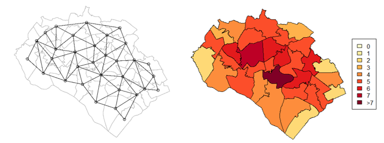
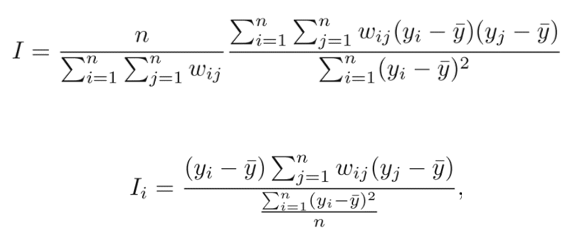

```{r include_packages_4, include = FALSE}
# This chunk ensures that the thesisdown package is
# installed and loaded. This thesisdown package includes
# the template files for the thesis and also two functions
# used for labeling and referencing
if (!require(remotes)) {
  if (params$`Install needed packages for {thesisdown}`) {
    install.packages("remotes", repos = "https://cran.rstudio.com")
  } else {
    stop(
      paste(
        'You need to run install.packages("remotes")',
        "first in the Console."
      )
    )
  }
}
if (!require(dplyr)) {
  if (params$`Install needed packages for {thesisdown}`) {
    install.packages("dplyr", repos = "https://cran.rstudio.com")
  } else {
    stop(
      paste(
        'You need to run install.packages("dplyr")',
        "first in the Console."
      )
    )
  }
}
if (!require(ggplot2)) {
  if (params$`Install needed packages for {thesisdown}`) {
    install.packages("ggplot2", repos = "https://cran.rstudio.com")
  } else {
    stop(
      paste(
        'You need to run install.packages("ggplot2")',
        "first in the Console."
      )
    )
  }
}
if (!require(bookdown)) {
  if (params$`Install needed packages for {thesisdown}`) {
    install.packages("bookdown", repos = "https://cran.rstudio.com")
  } else {
    stop(
      paste(
        'You need to run install.packages("bookdown")',
        "first in the Console."
      )
    )
  }
}
if (!require(thesisdown)) {
  if (params$`Install needed packages for {thesisdown}`) {
    remotes::install_github("ismayc/thesisdown")
  } else {
    stop(
      paste(
        "You need to run",
        'remotes::install_github("ismayc/thesisdown")',
        "first in the Console."
      )
    )
  }
}
library(thesisdown)
library(dplyr)
library(ggplot2)
library(knitr)
flights <- read.csv("data/flights.csv", stringsAsFactors = FALSE)
library(kableExtra)
```


# Methodology {#Methodology}

Spatial autocorrelation is Tobler’s first law of geography, famously stated as: “everything is related to everything else, but near things are more related than distant things”. In clarifying the terms of importance behind Tobler’s first law, spatial autocorrelation relates to dependence, whereas spatial heterogeneity relates to spatial structure [@anselin1988]. Spatial autocorrelation, and in turn diffusion, is measured separately from spatial heterogeneity. Despite the focus on spatial autocorrelation, models assessing spatial heterogeneity are relevant within fertility research. In explaining spatial variation in fertility, @jeronimomuniz2006 finds Geographically-Weighted Regression (GWR) to perform better when measuring adjusted R-squared value compared to spatial autocorrelation models. In a South Korean example, @jung2019 also find a GWR model to have a higher R-squared value than a spatial autoregressive model in the same setting, with GWR greatly reducing spatial autocorrelation in the residuals. @haque2019 model the 621 districts of India using a global autocorrelation model and GWR local model to explain spatial fertility differentials. The differences in model performance are small when considering the significance of the theoretical approach, as the driving force for model selection is the theory, rather than explicit performance statistics.  

In terms of specific packages used within R to enable this research, the `spatialreg` package is used to calculate weight matrices as well as the spatial models. Other packages such as `tidyverse`, `rgeos`, `sf` and `rdgal` are also replied upon for data management. All of the code used to conduct the methodology and results are available on GitHub in the [‘Dissertation’ repository](www.github.com/ross-barker-soton.com).In checking the reproducibility of the code and data used within R, the neighbourhood matrices, weights matrices, Spatial Lag Model and Spatial Error model were also tested in GeoDa. A region identifier is also used to check that the variable data and map file are correctly aligned when applying the weights matrices. The spatial econometric work of Luc Anselin informs the models, with the application of such models to R aided by materials from a course led by Sebastian Klüsener. The sources of code within this methodology are also partly derived from Roger Bivand’s (2019) analyses of spatial data as well as code published relating to Mark Burkey’s spatial [Burkeyacademy](http://spatial.burkeyacademy.com/).

A “specific-to-general” approach @elhorst2014 is followed in the model-building process, in the order: Ordinary-Least Squares (OLS), Spatial Lag (SAR) model, Spatial Error Model (SEM), Spatial Durbin Model (SDM) and Spatial Durbin Error Model (SDEM). The SAR, SER and SDM models are from @anselin1988, but the notation here is largely taken from @elhorst2014. The specific-to-general approach allows for a gradual increase in model complication and allows for earlier models to be nested in the latter models. The model terms show the role of spatial autocorrelation from different sources. In differentiating between standard OLS and spatial models, Elhorst (2014, p.5) directly state the spatially explicit variables as being:

* Endogenous interaction effects in the dependent variable (Y)
  * Seen in the notation as $\rho Wy$.
* Exogenous interaction effects among the independent variable (X)
  * Seen in the notation as $WX\theta$.
* Interaction effects among the error terms ($\varepsilon$)
  * Seen in the notation as $u=\lambda Wu+\ \varepsilon$.

The methods relating to spatial autocorrelation and the model-building process are split into five sections. First, the identification of neighbours (6.1) and the creation of a spatial weight’s matrix (6.2) form the cornerstone of the spatial approach. Following the selection of the row-standardised weight’s matrix, spatial analysis can be undertaken with spatial autocorrelation tests (6.3), namely Local and Global Moran’s I (Moran, 1950). The following model building process is twofold. First, the spatial elements stated above are added to the base OLS (6.4) and model selection methodologies are used to test which model and associated autoregression parameter is of best-fit and methodologically sound (6.5).

## Calculating neighbour and weight matrices
The matrix captures two dimensions of spatial information, adding values to cross-sectional dependence between observations similar to time measurement in time series analysis [@kondo2016]. `nb` relates to an unedited neighbourhood matrix, and $W$ is the spatial weights matrix calculated with the `nb` matrix, necessary in cross-sectional analysis. `nb` simply identifies neighbours within the shapefile, shown in Figure 4.1. For instance, the neighbourhood of Highfield towards the North of Southampton neighbours 6 other MSOAs. The simplicity of the queen contingency-based neighbourhood matrix is routed in the theory of social contagion. That is, direct neighbours influence one another, rather than large-scale processes. Any length or type of border is treated as a neighbouring region, thereby inferring queen-based measurement rather than rook. 0 is given to non-neighbouring nodes (and the diagonal) and 1 is given to neighbouring nodes. This results in symmetricity in the `nb` file. Additional neighbour-identifying processes are possible (K-nearest, Distance 5km, Distance 10km, 2nd-order queen, Rook) but fall outside the contagion context. The resulting `nb` of network size (N) of 7,200 unique areas contains 41,870 non-zero links, with the average number of links being 5.815. 

```{r figure3, warnings=FALSE, messages=FALSE, fig.cap="Neighbourhoods of Southampton.Note: links between Southampton and surrounding areas will be present; this figure is only for descriptive purposes. UK data service, own depiction.", out.width = "95%", echo=FALSE, warning=FALSE}
# All defaults
library(knitr)    # For knitting document and include_graphics
library(captioner)
library(ggplot2)  # For plotting
library(png)

```

By excluding of the Isles of Scilly from the dataset, there are no MSOAs without neighbours, yet, there are two isolated islands within the dataset: the Isle of Anglesey and the Isle of Wight. Due to the small-scale concept of neighbour, adding a link to the mainland is avoided. Scotland is the only land border lacking from this data, and the absence of neighbour-to-neighbour transmission over the Scottish-English border results in bias. Following the creation of neighbours, spatial dependence is added by transforming `nb` into $W$.  As with the `nb` matrix, $W$ is of the dimension of the number of nodes in the network, **N.** The $W$ matrix contains interactions which are of strength $W_{ji}$. Here, $i$ is a neighbour (MSOA) and $j$ is a neighbour’s neighbour. The combination of `W` and the endogenous spatial lag $Y$, creates the spatial lag matrix $Wy$, whereas the combination of the explanatory variables results in $WX$, implying dependence. The following matrices are based on Anselin’s work. 
&nbsp;  

${W\ }_{queen\left(Contiguity\right)}=\left(\begin{matrix}\begin{matrix}w_{11}&w_{12}&w_{13}&w_{14}\\w_{21}&w_{22}&w_{23}&w_{24}\\w_{31}&w_{32}&w_{33}&w_{34}\\w_{41}&w_{42}&w_{43}&w_{44}\\\end{matrix}\\\end{matrix}\right)\ \ \ \ \ {nb\ }_{queen\left(Contiguity\right)}=\left(\begin{matrix}\begin{matrix}0&1&0&0\\1&0&1&1\\0&1&0&1\\0&1&1&0\\\end{matrix}\\\end{matrix}\right)\ \ \ \ $
&nbsp;  

The outcomes of autocorrelation and the hypotheses rejected/accepted depend on the neighbourhood and weights matrices chosen to varying degrees [@bivand2013]. The `nb` calculation is more important than $W$, as the method of $W$ standardisation has relatively little effect on spatial regression results [@dormann2007;@lesage2014]. The standardisation and application of spatial weights matrices are either p-order, binary, contingency matrices, inverse distance, q-nearest neighbour, or  block diagonal [@elhorst2014]. Binary coding is preferred when little is known about the spatial processes ongoing [@bavaud1998], whereby neighbouring nodes are of equal influence regardless of the number of neighbours. The row-standardised approach assumes that the influence of a neighbour is spread between neighbours, therefore, no areas are heavily overpowered in influence. The row-standardisation approach leads to asymmetry in the matrix as by normalising $W$, whereas the `nb` matrix is symmetric. Row normalisation equalises the impact of each MSOA, with no neighbourhood being more powerful than another [@elhorst2014]. In doing so, the sum of each row is 1, and the sum of all weights is 7200 (**N**). 
&nbsp;  

$W_{row-standardised}=\left(\begin{matrix}\begin{matrix}0&0.5&0.5&0\\0.33&0&0.33&0.33\\0.33&0.33&0&0.33\\0&0.5&0.5&0\\\end{matrix}\\\end{matrix}\right)\ $
&nbsp;  

$Wy=\left(\begin{matrix}\begin{matrix}0&0.5&0.5&0\\0.33&0&0.33&0.33\\0.33&0.33&0&0.33\\0&0.5&0.5&0\\\end{matrix}\\\end{matrix}\right)\ \left(\begin{matrix}\begin{matrix}y_1\\y_2\\y_3\\y_4\\\end{matrix}\\\end{matrix}\right)\ =\ \left(\begin{matrix}\begin{matrix}{1/2y}_2\ +\ {1/2y}_3\\{1/3y}_1\ +\ {{1/3y}_3\ +\ 1/3y}_4\\{1/3y}_1\ +\ {1/3y}_2+{1/3y}_3\\{1/2y}_2\ +\ {1/2y}_3\\\end{matrix}\\\end{matrix}\right)\ $
&nbsp;  

## Spatial autocorrelation tests
Following the finalisation of first-order contingency weights, both local and global tests of Moran’s I are used to test for the existence of spatial dependence and illustrate dependence. The resulting values range from -1 to +1, with 0 showing no autocorrelation. -1 suggests negative spatial autocorrelation with neighbours showing opposing outcomes, whereas a positive Moran’s I value shows positive association, as expected though social contagion processes. Local Indicators of Spatial Autocorrelation [LISA, @anselin1995] diagnose specific units exhibiting spatial dependence, and the LISA values sum to equal the global Moran’s I statistic [@darmofal2015]. The LISA values are accompanied by significance p-values, showing areas of high-high, low-high, high-low, and low-low spatial dependence. The Moran scatter plot will display these alternative outcomes.

Moran’s I is based on the spatial lag of the variable of choice, as a ratio of $Y$ and its spatial lag [@bivand2013]. In the equation, as shown and explained by @bivand2013, $W_{i}$ is the $i$th observation, and $\bar{y}$ is the mean of the variable of interest. This is seen in the Moran scatter plot as the centre. $W_{ij}$ is again the link between area $i$ and its neighbour $j$. Deviance from the mean is therefore associated with assumed spatial dependence. As Local Moran’s I relates to individual observations ($i$)and sums to the Global value, the same assumptions as above are used. The greatest difference is testing for the divergence of one particular area from the global mean. The Moran’s I calculation is also used as a diagnostic tool for OLS residuals, specified as unfocused diagnostics, and generally identifying spatial dependence [@darmofal2015]. The Moran’s I statistic is not useful for the comparison of spatial autoregressive models, as including a spatial element will undoubtably lead to a reduction in residual spatial dependence.

```{r equations, warnings=FALSE, messages=FALSE, out.width = "65%", echo=FALSE, warning=FALSE}
# All defaults
library(knitr)    # For knitting document and include_graphics
library(captioner)
library(ggplot2)  # For plotting
library(png)

```

## Model equations
OLS is used as a benchmark in model comparison and as a starting point for the incorporation of spatially explicit variables. In selecting and analysing the results of a spatial model, either (or both) global and local effects are included, dependent on the type of spatial effect. Endogenous interaction cannot lead to just local spillovers, as a change in one neighbourhood can lead to global changes, with local spillover relating clearly to social contagion [@lesage2014]. For example, the autocorrelation between two neighbourhoods in Cornwall will be felt, even to a very minuscule amount, in Southampton, a feature known as simultaneous feedback [@lesage2008]. Local models restrict effects of autocorrelation to direct neighbours, and result in no feedback throughout the entire model, occurring in the Spatial Error Model.  
&nbsp;  

$y=\beta_0+X\beta+\ \varepsilon$                                               &nbsp;  
&nbsp;  

The model explanations and notations are a mixture of sources, largely from @elhorst2014 and @anselin1988. First, Ordinal Least-Squares Regression (OLS) is presented. As common throughout all models, $X$ is a matrix of the explanatory variables and $\beta$ is the respective vector, representing the linear slope inferred by the explanatory variables. $\varepsilon$ is the independent error term prevalent throughout all models.  
&nbsp; 

$y\ =\rho Wy+X\beta+\ \varepsilon$  
&nbsp; 

Second, the Spatial Lag (SAR) model hosts one addition to OLS; $\rho Wy$, which adds spatial autoregression of the $Y$ variable. The $\rho$ is the strength (coefficient) of the endogenous, spatially lagged dependent variable $Wy$, with this model therefore often termed the simultaneous autoregressive model. $W$ is the spatial weight matrix. The SAR model has been criticised for omitting spatially dependent variables, $WX$, which could lead to $Wy$ being significant, when this is in fact not the case [@corrado2012], an issue overcome in the Spatial Durbin Model. In essence, the SAR model assumes directional spatial effect from one area to its neighbour, closely supported by the theoretical background of this dissertation.  
&nbsp; 

$y\ =X\beta+u,\ u=\lambda Wu+\ \varepsilon$  
&nbsp; 

Third, the Spatial Error Model (SEM) includes spatial autoregression in the disturbance process $varepsilon\ $, rather than in the dependent or explanatory variables, diverging from the theoretical standpoint of this dissertation. The new addition to this variable is $Wu$, which is the interaction effect in the disturbance term. This model is similar to the OLS model in lacking the required analysis of direct, indirect and total impacts, and can be interpreted similarly [@elhorst2014]. The total impacts are calculated by Monte Carlo simulation as described by [@lesage2010]. The spatial autoregressive coefficient is shown in model output as $lambda\ $. In sum, the spatial autocorrelation in the SEM is seen as a nuisance that is not linked to a specific cause, whereas SAR directly incorporates y [@harris2009]. The model is therefore not very spatial in nature, dealing with clustering. This model is therefore not expected to be theoretically justifiable, but will aid in model comparison.  
&nbsp; 

$y\ =pWy+X\beta+WX\theta+\ \varepsilon$   
&nbsp; 

Fourth, the Spatial Durbin Model (SDM) builds upon the SAR model through the inclusion of spatial autocorrelation in the explanatory variables. This in turn adds a local aggregation component to the SAR model [@dormann2007]. The addition to this model is $WX\theta+\ $, which describes the coefficients of the spatially lagged explanatory variables $WX$. $\theta+$ functions similarly to $\beta$, but represents unknown parameters. By including both $WX$ and $Wy$ in the model, the omitted variable problem that boosts the endogenous spatial lag significance is mitigated as well as allowing exogenous variation [@corrado2012]. Therefore, a more methodologically sound and accountable model is produced, although interpretation is less intuitive. In comparing SDM results to the SAR model, effects are often greater in the SDM model due to the exogenous interaction [@golgher2016]. Both the SAR and SDM model contain lagged $y$,  and therefore cannot treat the coefficients of the summary model as marginal effects, but instead calculate direct (DE), indirect (IE) and total marginal effects (TE) [@bivand2013].  
&nbsp;  

$y\ =X\beta+Wx\theta+\ u,\ u=\lambda Wu+\ \varepsilon$  
&nbsp;  

Fifth, the Spatial Durbin Error Model (SDEM) adds lagged $X$ variables to the SEM, similarly to SDM gaining lagged $y$. This model therefore does not include the y variable as an explanatory variable within the model. Due to the catch-all characteristic that arises from the inclusion of error interaction, the interpretation of the model is far from intuitive, although the comparative strength of the model is expected to be high. 

## Robustness checks
Model specification is largely derived from tests on the OLS model. The analytical approach within this dissertation expects both diffusion and the clustering of similar behaviours, therefore, both the SAR model and the SEM are expected to be robust. Questions arise as to whether the model should be further complicated to the SDM in order to account for potentially significant exogenous effects. @lesage2014a argue that only the SDM and SDEM models should be considered in spatial modelling, as they capture the effects of the SAR model and SEM, while accounting for conflicting spatial processes that would arise bias if omitted. The diagnostic approach uses Larange Multiplier (LM) tests to navigate model specification. 

First, LM Tests based on the OLS results are undertaken, whereby the weights matrix is incorporated into the test to decide whether the SAR model and/or SEM is justifiable [@anselin1996]. These tests are written as LMerr and LMlag. Whether LMerr or LMlag is significant shows which model should be continued and built upon further, in this case either in a SDM or SDEM. The focussed diagnostics above identify either spatial lag or spatial error dependence, but a standard LR test cannot be used as one could element may detect the other [@darmofal2015]. Therefore, robust LM diagnostic tests developed by @bera1993 are used that account for false positives, named RLMerr and RLMlag that are robust to the presence of the other type of autocorrelation. Once completed, the Akaike Information Criterion [AIC, @akaike1974] is used to compare models, as the adjusted R-squared value is incomparable with the autoregressive models used. 
