```{r include_packages_5, include = FALSE}
# This chunk ensures that the thesisdown package is
# installed and loaded. This thesisdown package includes
# the template files for the thesis and also two functions
# used for labeling and referencing
if (!require(remotes)) {
  if (params$`Install needed packages for {thesisdown}`) {
    install.packages("remotes", repos = "https://cran.rstudio.com")
  } else {
    stop(
      paste(
        'You need to run install.packages("remotes")',
        "first in the Console."
      )
    )
  }
}
if (!require(dplyr)) {
  if (params$`Install needed packages for {thesisdown}`) {
    install.packages("dplyr", repos = "https://cran.rstudio.com")
  } else {
    stop(
      paste(
        'You need to run install.packages("dplyr")',
        "first in the Console."
      )
    )
  }
}
if (!require(ggplot2)) {
  if (params$`Install needed packages for {thesisdown}`) {
    install.packages("ggplot2", repos = "https://cran.rstudio.com")
  } else {
    stop(
      paste(
        'You need to run install.packages("ggplot2")',
        "first in the Console."
      )
    )
  }
}
if (!require(bookdown)) {
  if (params$`Install needed packages for {thesisdown}`) {
    install.packages("bookdown", repos = "https://cran.rstudio.com")
  } else {
    stop(
      paste(
        'You need to run install.packages("bookdown")',
        "first in the Console."
      )
    )
  }
}
if (!require(thesisdown)) {
  if (params$`Install needed packages for {thesisdown}`) {
    remotes::install_github("ismayc/thesisdown")
  } else {
    stop(
      paste(
        "You need to run",
        'remotes::install_github("ismayc/thesisdown")',
        "first in the Console."
      )
    )
  }
}
library(thesisdown)
library(dplyr)
library(ggplot2)
library(knitr)
flights <- read.csv("data/flights.csv", stringsAsFactors = FALSE)
library(kableExtra)
```


# Results
The results of the data analysis and models are presented here in four sections. First, univariate and bivariate statistical analysis is undertaken (7.1), focussing on the spatial, unmodelled description of the data. Second, Global Moran’s I is used to test whether spatial autocorrelation exists in TFR in England and Wales (7.2); all variables will be tested in this manner. Local Moran’s I is used to display clustering of neighbourhoods that exhibit spatial dependence. Third, an OLS model will be built with all the variables deemed significant based on the literature and theoretical approach (7.3), with stepwise addition of the variables. This section will display how Global Moran’s I changes with the addition of variables and whether such variables may account for what is assumed to be spatial autocorrelation led by social networks. The fourth and final section compares the four spatial models in exploring and interpreting small-scale fertility determinants (7.4). 

## Descriptive results
### Total Fertility Rate
The TFR of England and Wales was 1.93 in 2011, with the values of MSOA TFR varying from 0.304 to 4.584, with a mean of 1.961. England and Wales has relatively high TFR in the European context, following a decline from 1.93 in 2011 to 1.65 in 2019 (ONS, 2020). England and Wales has never experienced lowest-low fertility of below 1.3 [@kohler2002b], but 342 of the 7,200 MSOAs are within this classification in 2011. Moreover, 2,750 MSOAs host TFR above replacement level (2.1). Vast spatial differentiation is present, with local context seeming to influence fertility greatly. ASFRs also vary similarly. The mean value of ASFR ages 15-24 is 49.1 births per 1,000 women, with a height of 188 births per 1,000 women. The mean value of ASFR ages 25-34 is 110 births per 1,000 women, with a height of 215 births per 1,000 women. The mean fertility rate of the women aged 35-44 is 36 births per 1,000 women, with a height of 123 births per 1,000 women. Figure 5.1 shows the temporal change in TFR distribution of MSOAs in 2002, 2011 and 2018, coloured by the TFR value of each neighbourhood in 2011, being low (<1.3), middle (1.3-2.1) and high (>2.1). Throughout the time period, there appears to be little difference in the location of lowest-low fertility within England and Wales, with the distribution remaining normal.

```{r figure4, warnings=FALSE, messages=FALSE, fig.cap="MSOA TFR Histogram. Note: Low (<1.3), middle (1.3-2.1) and high (>2.1) TFR categorisation taken from 2011 levels. Source: ONS, own calculations.", out.width = "95%", echo=FALSE, warning=FALSE}
# All defaults
library(knitr)    # For knitting document and include_graphics
library(captioner)
library(ggplot2)  # For plotting
library(png)
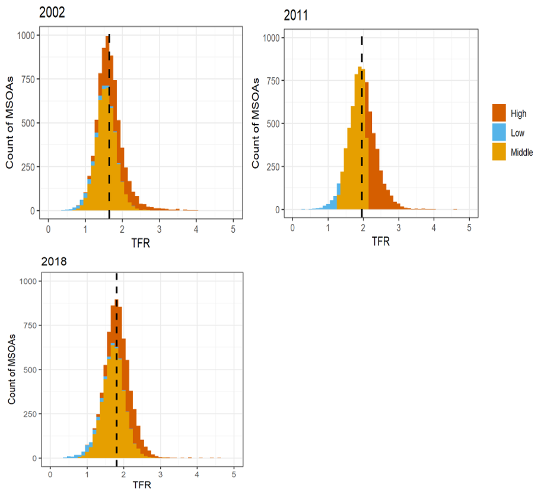
```
```{r figure5a, warnings=FALSE, messages=FALSE, fig.cap="Regional TFR 2002. Source: ONS, own calculations.", out.width = "95%", echo=FALSE, warning=FALSE}
# All defaults
library(knitr)    # For knitting document and include_graphics
library(captioner)
library(ggplot2)  # For plotting
library(png)
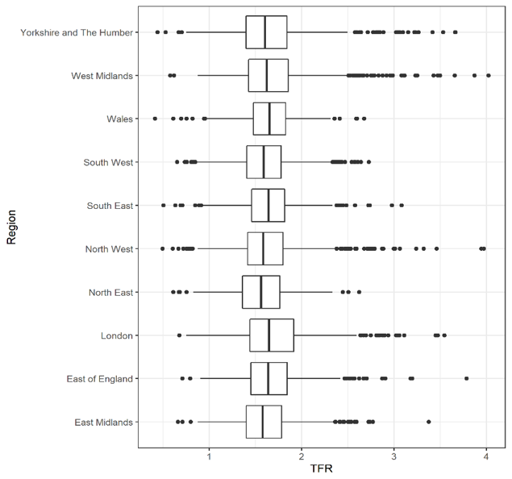
```

```{r figure5b, warnings=FALSE, messages=FALSE, fig.cap="Regional TFR 2011. Source: ONS, own calculations.", out.width = "95%", echo=FALSE, warning=FALSE}
# All defaults
library(knitr)    # For knitting document and include_graphics
library(captioner)
library(ggplot2)  # For plotting
library(png)
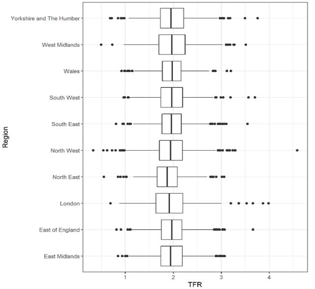
```

```{r figure5c, warnings=FALSE, messages=FALSE, fig.cap="Regional TFR 2018. Source: ONS, own calculations.", out.width = "95%", echo=FALSE, warning=FALSE}
# All defaults
library(knitr)    # For knitting document and include_graphics
library(captioner)
library(ggplot2)  # For plotting
library(png)
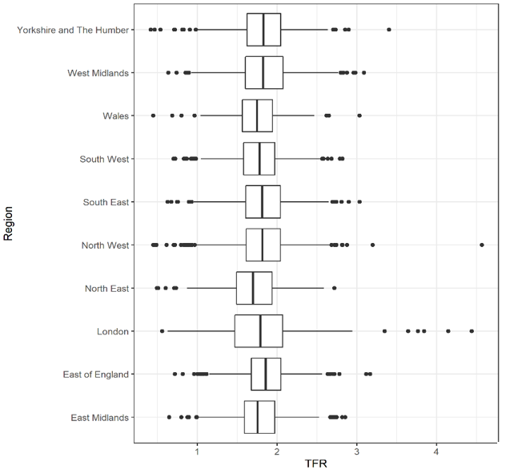
```

The regional differences in TFR are not greatly pronounced. The temporal changes are, however, as the rise in TFR to 2011 shows all regions approaching mean TFR of 2, whereas in 2002, no regions had an upper quartile within this range. 2018 data shows a return to levels similar to 2002, with regions hosting slightly lower TFR than in 2011 and retaining regional differences. The region showing the greatest variance is London at each time point, as well as continuously hosting outliers with very high TFR above 3. At each time, an MSOA with extremely low and extremely high TFR is present in each region, with no evidence of fertility behaviour convergence to the national average. In sum, there are clear local differences that persist throughout England and Wales, and no evidence in support of regional convergence.

### Explanatory Variables
```{r table2, echo=FALSE, warning=FALSE }
library(knitr)    # For knitting document and include_graphics
library(read.so) # to read in .md files
library(kableExtra)
tibble2 <- read.csv("figure/Table_2.csv")
kbl(tibble2, booktabs = T, caption = "Descriptive statistics of explanatory variables, 2011.") %>%
  kable_styling(full_width = T) %>%
  add_footnote("The spatial autocorrelation graphs are in appendix 1. Source: ONS, own calculations.", notation = "none")


```

Table 5.1 shows the explanatory variables used in the 2011 models. These varaibles coded in percentage terms mostly show large variance, with the proportion of the adult population who are divorced showing the smallest range. This is accompanied by a relatively low mean divorced proportion of 9.1%. University-level education has a very wide range and mean of 29.2%. The Global Moran’s I values are significant at the 0.001% level and positive for each variable, showing that all are positively spatially dependent, similarly to TFR. Expectedly, spatial autocorrelation is very strong in the population density variable. The Black African population is similarly highly spatially autocorrelated, and social housing is the explanatory variable showing the lowest Moran’s I value.

```{r figure6, warnings=FALSE, messages=FALSE, fig.cap="Bivariate Correlation. Source: ONS, own calculations.", out.width = "95%", echo=FALSE, warning=FALSE}
# All defaults
library(knitr)    # For knitting document and include_graphics
library(captioner)
library(ggplot2)  # For plotting
library(png)
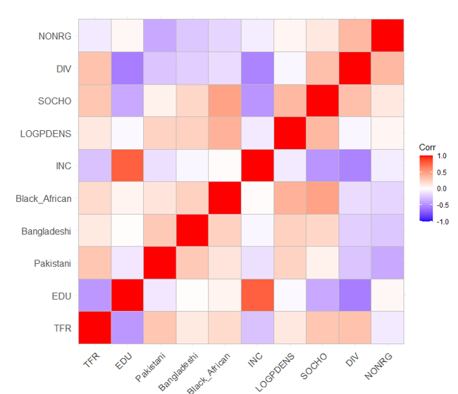
```

A correlation matrix is shown in Figure 5.5, with the highest correlations occurring in the relationships that include income and education. Income appears to be a leading variable showing very negative association with social housing and the divorce variable. Divorce is also very negatively associated with education. Only Bangladeshi-Education and Black African-Income associations are non-significant. TFR-specific bivariate associations are also displayed in figure 5.6 on the following page. University-level education has a clear negative relationship with TFR. In contrast, the Pakistani, Bangladeshi and Black African variables are clearly positively associated with TFR. Income appears to be negatively associated with TFR, however, once reaching roughly £500 net income per week, the effect of income appears to flatline. Population density shows a slightly inverted U-shaped curve; TFR increases gradually to a population density around 5,000 residents/km2, roughly comparable to a town or city centre. Then, areas of very high population density have increasingly low TFR. The argument within the literature that low population density is associated with low TFR may not hold within the UK context, as it appears that very rural areas host some of the lowest fertility, alongside highly urban city centre neighbourhoods. Socially rented dwellings, similarly to the ethnicity results, show a clear increase in TFR as the proportion of socially rented homes increase. As divorce prevalence in a neighbourhood increases, as does TFR. The non-religious variable is less clear, as the influence is felt at the lowest and highest values of non-religious proportions, and not in the central, most frequent counts. Therefore, the role of non-religious proportions seems to be one of the weakest variables included.

```{r figure7, warnings=FALSE, messages=FALSE, fig.cap="Bivariate association with line of best fit. N=7200. Source: ONS, own calculations.", out.width = "95%", echo=FALSE, warning=FALSE}
# All defaults
library(knitr)    # For knitting document and include_graphics
library(captioner)
library(ggplot2)  # For plotting
library(png)
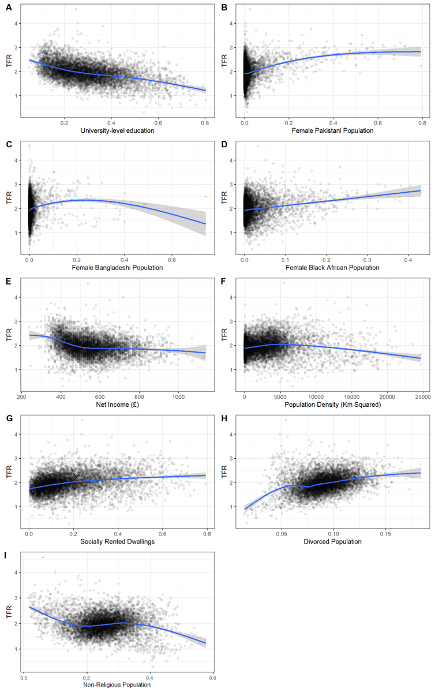
```

## Global and Local Moran’s I

```{r figure8, warnings=FALSE, messages=FALSE, fig.cap="Global Moran's I - Fertility variables. Source: ONS, own calculations.", out.width = "95%", echo=FALSE, warning=FALSE}
# All defaults
library(knitr)    # For knitting document and include_graphics
library(captioner)
library(ggplot2)  # For plotting
library(png)
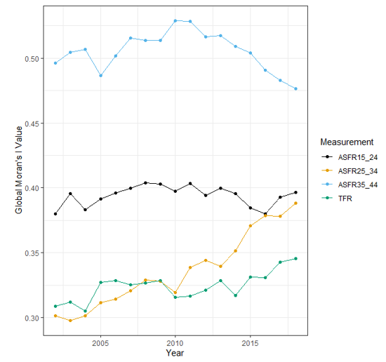
```

This section addresses the first research question: is there spatial autocorrelation in fertility outcomes, and if so, has this been weakening or strengthening over time (from 2002-2018)? Figure 5.7 shows global Moran’s I calculated for ASFRs and TFR from 2002 to 2018. Throughout the roughly two decades, the spatial autocorrelation of the separate ASFRs show three separate trends. All three ASFRs are highly significantly spatially autocorrelated, however, the increase in TFR spatial dependence may be led by an uptake in the spatial dependence of fertility of women aged 25 to 34. This group of women hosted the lowest Moran’s I value in 2002, far below that of women aged 15 to 24. However, the gap between these two measures is near-eliminated by 2018. The ASFR of women aged 35 to 44 remains the highest throughout the time period but shows a gradual and persistent decline from 2013 to 2018. Only the spatial autocorrelation value of women aged 15 to 24 has remained stable, while the two remaining groups showed marked changed beginning roughly in 2014. The answer to the question is therefore that the differences in spatial autocorrelation between ASFRs has weakened, however, the spatial dependence of TFR has strengthened.

```{r figure9, warnings=FALSE, messages=FALSE, fig.cap="Spatially lagged TFR versus TFR. Source: ONS, own calculations.", out.width = "95%", echo=FALSE, warning=FALSE}
# All defaults
library(knitr)    # For knitting document and include_graphics
library(captioner)
library(ggplot2)  # For plotting
library(png)
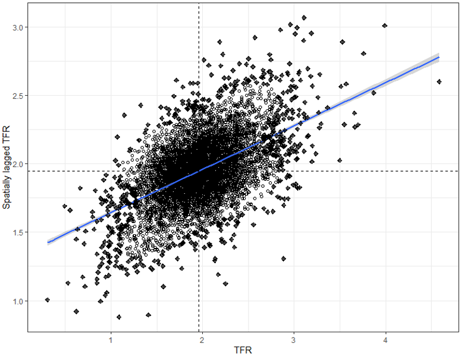
```

The Global Moran’s I value of TFR in 2011 provides a value of 0.3167, significant at the 0.001% level. This background of this value is shown in Figure 5.8, with TFR plotted against spatially lagged TFR. The quadrants of the graph display high-high (top right) and low-low (bottom left) relationships with significance increasing the further from the centre (mean). Low-high values are situated in the top left, and high-low values in the bottom right, showing negative autocorrelation, although few are significant at the 5% level, as seen in the oncoming maps. The scatterplot shows positive autocorrelation, with a general sign that the higher TFR of area $i$, the higher the TFR of $i$’s neighbour, $j$, and vice versa. The pattern in Local Indicators of Spatial Autocorrelation (LISA) shows substantive variability even within towns, relationships overlooked by regional and national analyses. The LISA values are mapped on the three following pages, whereby the clustering of spatial dependence can be seen. The example of London contains patterns seen nationally, with low-low dependence in the highly urbanised, very highly populated areas, and high-high significance in areas with large amounts of high-fertility ethnic minorities. Significant clustering is rarely isolated between two neighbourhoods, but rather a collection of spatially dependent MSOAs. Examples of the clustering phenomenon are in MSOAs surrounding Winchester in the South East of England, and a corridor of low-low dependence meandering down the centre of Devon and Cornwall, linked to Ilfracombe.


```{r figure10, warnings=FALSE, messages=FALSE, fig.cap="Local Moran's I values. North West England (Top), North East England (Middle), Yorkshire and the Humber (Bottom). Source: ONS, UK data service, own calculations", out.width = "95%", echo=FALSE, warning=FALSE}
# All defaults
library(knitr)    # For knitting document and include_graphics
library(captioner)
library(ggplot2)  # For plotting
library(png)
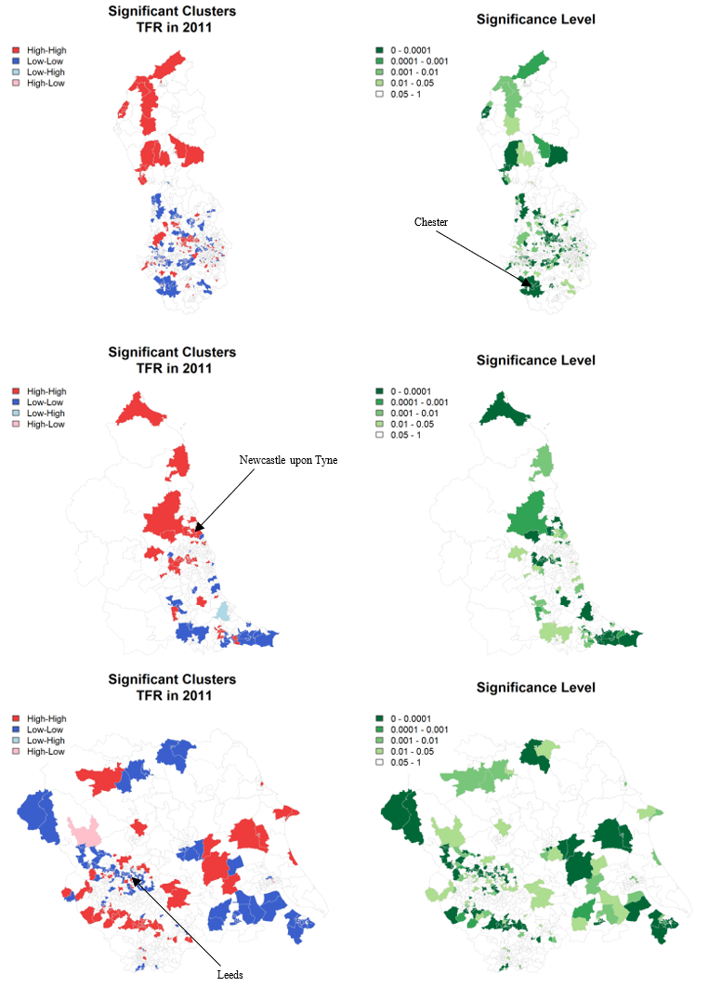
```

```{r figure11, warnings=FALSE, messages=FALSE, fig.cap="Local Moran's I values. East Midlands (top), Wales (middle), East of England (bottom). Source: ONS, UK data service, own calculations", out.width = "95%", echo=FALSE, warning=FALSE}
# All defaults
library(knitr)    # For knitting document and include_graphics
library(captioner)
library(ggplot2)  # For plotting
library(png)
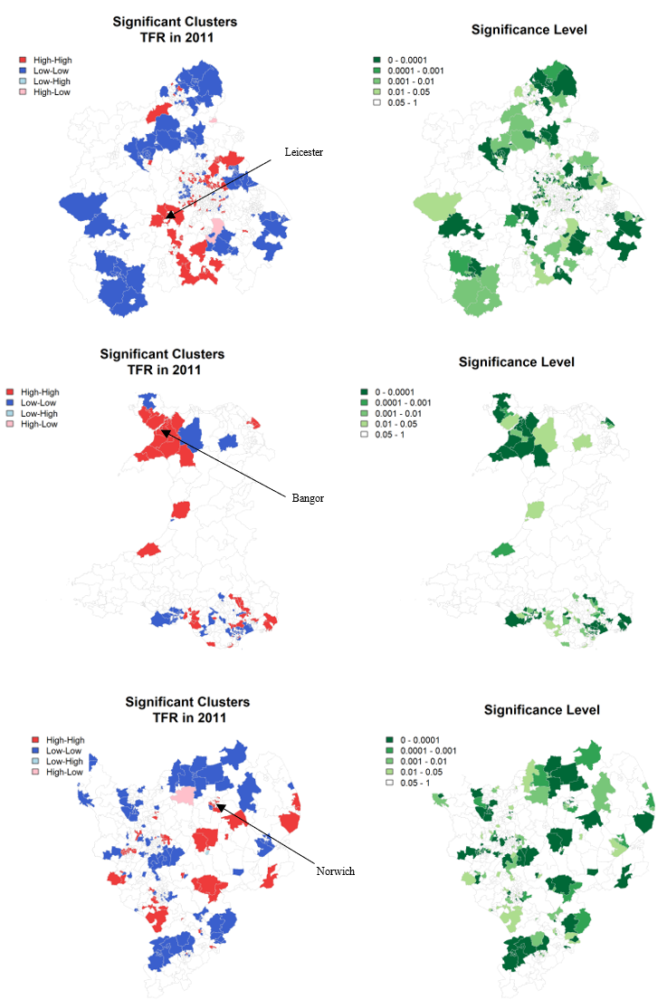
```


```{r figure12, warnings=FALSE, messages=FALSE, fig.cap="Local Moran's I values. South East England (top), London (middle), South West England (bottom). Source: ONS, UK data service, own calculations", out.width = "95%", echo=FALSE, warning=FALSE}
# All defaults
library(knitr)    # For knitting document and include_graphics
library(captioner)
library(ggplot2)  # For plotting
library(png)
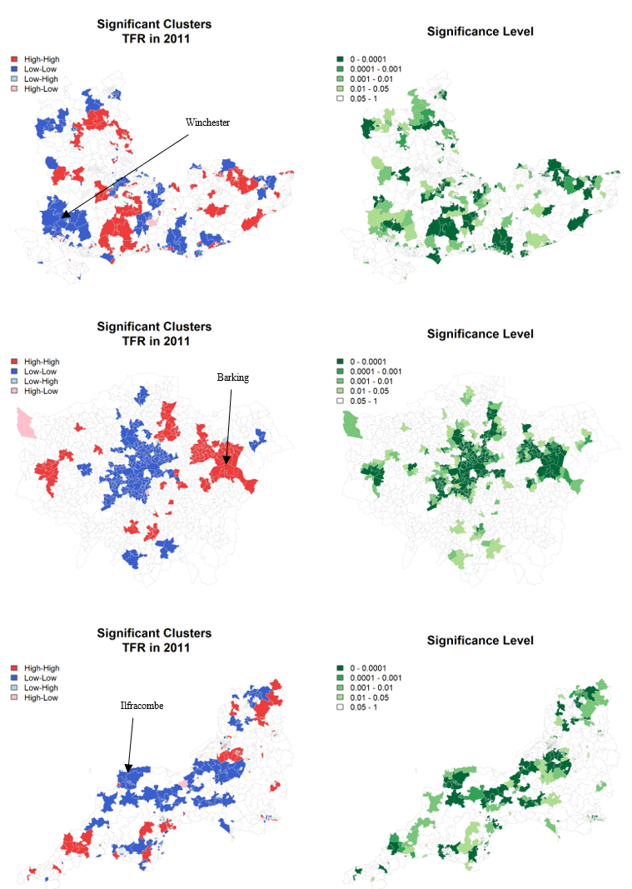
```


```{r table3, echo=FALSE, warning=FALSE }
library(knitr)    # For knitting document and include_graphics
library(read.so) # to read in .md files
library(kableExtra)
tibble3 <- read.csv("figure/Table_3.csv")
colnames(tibble3) <- c("Variable", "Model 1","Model 2", "Model 3", "Model 4","Model 5","Model 6","Model 7","Model 8","Model 9")
kbl(tibble3, booktabs = T,  longtable = T, caption = "OLS Results (discussed on the following page).") %>%
  kable_styling(full_width = T, font_size = 8) %>%
  kableExtra::landscape() %>%
  add_footnote("*** P<0.001; ** p<0.01; * p <0.05. Observations: 7,200. Standard error in parentheses. ONS, own calculations." , notation = "none")
```

## Accounting for Significant Variables
This section addresses the second research question: If existent, does spatial autocorrelation remain when accounting for compositional and contextual determinants? Due to the violation of the OLS assumption that observation i does not influence observation j, the results are generally unreliable. However, the diagnostics of the model are useful in furthering the spatial analysis. That is, the spatial structure of the observations is ignored; therefore, the relevance of space can be seen within the residuals. In a clear example of model comparison, @golgher2016 map the residual diagnoistics of an OLS model that showed a need for spatial models due to a significant Moran’s I value. The first diagnostic will follow this approach in the inclsuion of variables into OLS to see whether spatial dependence of fertility is ommitted through the addition of variables.

Once the variables are included, Global Moran’s I of the residuals remains very high at 0.19 (from a height of 0.28), significant at the 0.001% level (Table 5.2). The final OLS model provides an adjusted R-squared value of 0.4. The adjusted R-squared ¬value shows a gradual increase as the model progresses, with the largest jump in the inclusion of education accounting for roughly 20% of the TFR outcome, while adjusted R-squared increases by 6% in the addition of Pakistani women. Income appears to be the third most influential variable alongside Bangladeshi and Black African women. The Akaike Information Criterion (AIC) decreases with the addition of most of the variables from 5032.43 in Model 1 to 2964.23 in Model 7. However, AIC increases once the non-religious population is added into the model, being the only variable to test as non-significant.

It is assumed that the majority of significant compositional and contextual explanatory variables are included within Model 8, and that part of the remaining spatial autocorrelation in the variables is a result of spatial processes that are excluded from OLS. Based on the Moran’s I result alone it is plausible to explore a spatial model. In addition to this diagnostic, the LMlag and LMerr results are significant at the 0.1% level, however, once applying robust LM tests, the spatial autogressive function of TFR is no longer a justifiable addition to base OLS. However, the p-value of the RLMlag test is 0.05, only slightly above the conventional threshold to be considered significant, suggests that some form of spatial endogenous interaction is occurring. The insignificant value may be explained by differing social network effects throughout the country and sub-populations, or being dependent on the weight’s matrix and MSOA boundaries used. Further exploration of spatially lagged TFR is necessary by analysing the Spatial Lag and Spatial Durbin models.


```{r figure13, warnings=FALSE, messages=FALSE, fig.cap="Diagnostics of OLS.", out.width = "95%", echo=FALSE, warning=FALSE}
# All defaults
library(knitr)    # For knitting document and include_graphics
library(captioner)
library(ggplot2)  # For plotting
library(png)
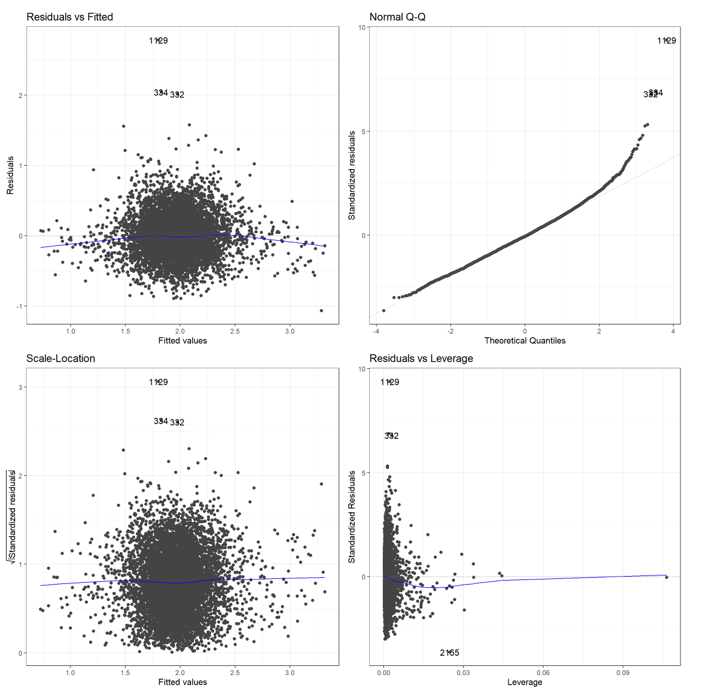
```

The OLS residual diagnostics above (Figure 5.12) do not appear to violate any OLS assumptions, although outliers are detected. Area 1129 is an area in Salford, while 334 and 332 surround Stamford Hill in inner London. The three areas host higher than expected TFR and appear to be practicing Jewish areas, a potential determinant that is excluded from the model. 2165 is a wealthy suburb of Bradford, West Yorkshire, and the reasoning for being an outlier in measuring leverage is unclear. The above diagnostics do not show any significant violation of OLS assumptions. The Farrar-Glauber test below provides overall multicollinearity diagnostics, and shows that collinearity is detected (Table 5.3). 

```{r table4, echo=FALSE, warning=FALSE }
library(knitr)    # For knitting document and include_graphics
library(read.so) # to read in .md files
library(kableExtra)
tibble4 <- read.csv("figure/Table_4.csv")
colnames(tibble4) <- c("Test", "MC Results","Detection")
kbl(tibble4, booktabs = T, caption = "Farrar-Glauber Test of Multicollinearity.") %>%
  kable_styling(full_width = T) %>%
  add_footnote("0 - collinearity is not detected; 1 - collinearity is detected." , notation = "none")
```

```{r table5, echo=FALSE, warning=FALSE }
library(knitr)    # For knitting document and include_graphics
library(read.so) # to read in .md files
library(kableExtra)
tibble5 <- read.csv("figure/Table_5.csv")
kbl(tibble5, booktabs = T, caption = "Individual collinearity.") %>%
  kable_styling(full_width = T) %>%
  add_footnote("0 - collinearity is not detected; 1 - collinearity is detected." , notation = "none")
```

Table 5.4 shows the output for the Variable Inflation Factor. The F-statistic for the university variable is highest (3.1028), followed by the income variable (2.9781), divorce (2.1591) and social housing (2.1327). This is an expected outcome and infers bias in oncoming results. Below, the normal distribution of residuals is shown (Figure 5.13). The right graph shows theoretical normal distribution in red, with the black line being the actual distribution. There is only a slight negative skew in the residuals. The residuals are also shown spatially in the following maps (Figure 5.14, 5.15), and the spatial clustering follows similar patterns as in the spatial dependence of TFR, suggesting that the causes of error and the causes of highly variant TFR are similar. Although the maps are informative and show clustering, the main result required is the Moran’s I value of the residuals, 0.19 at a significance level of 0.001%, thereby justifying the following spatial models. 

```{r figure14, warnings=FALSE, messages=FALSE, fig.cap="Normal Distribution in residuals.", out.width = "95%", echo=FALSE, warning=FALSE}
# All defaults
library(knitr)    # For knitting document and include_graphics
library(captioner)
library(ggplot2)  # For plotting
library(png)
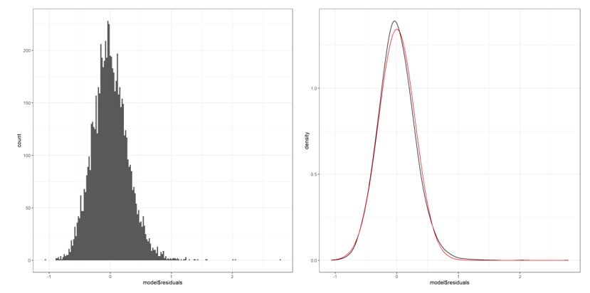
```

```{r figure15, warnings=FALSE, messages=FALSE, fig.cap="OLS Residuals. North West England (top left), North East England (top right), Wales (left), Yorkshire and the Humber (right), West Midlands (bottom left), East Midlands (bottom right). Boundary data source: UK data service, own depiction.", out.width = "95%", echo=FALSE, warning=FALSE}
# All defaults
library(knitr)    # For knitting document and include_graphics
library(captioner)
library(ggplot2)  # For plotting
library(png)
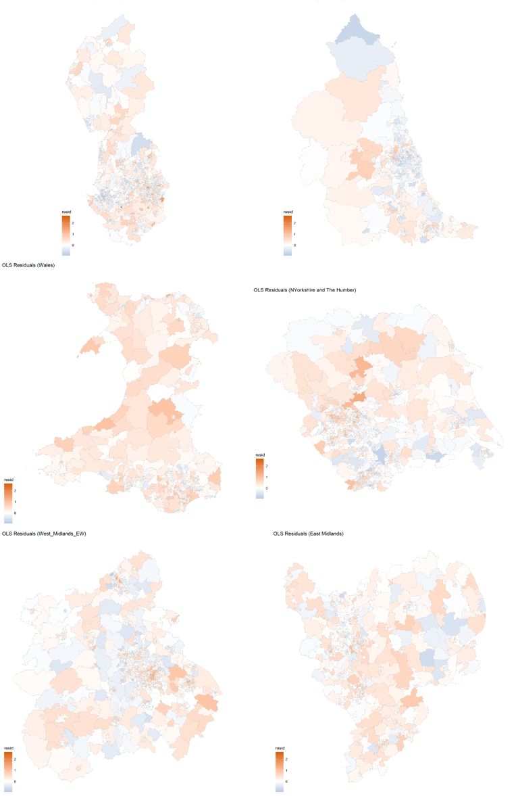
```

```{r figure16, warnings=FALSE, messages=FALSE, fig.cap="OLS Residuals. East of England (top left), London (top right), South West of England (bottom left), South East of England (bottom right). Boundary data source: UK data service, own depiction.", out.width = "95%", echo=FALSE, warning=FALSE}
# All defaults
library(knitr)    # For knitting document and include_graphics
library(captioner)
library(ggplot2)  # For plotting
library(png)
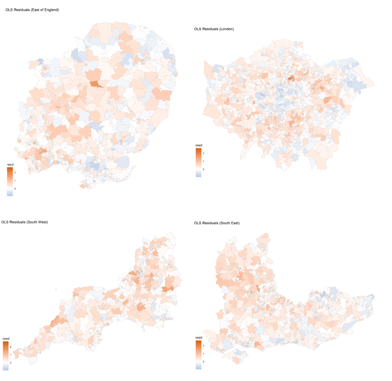
```

## Addition of Spatial Elements
This section addresses the question: does the inclusion of a spatial autoregressive element to base OLS aid in the explanatory power of small-scale fertility outcomes, signifying the necessary inclusion of neighbour-to-neighbour fertility diffusion? In approaching the question, four models are built and briefly interpreted. As previously stated, the interpretation of spatial models with exogenous and endogenous effects differs from conventional least squares regression. The interpretation of the SAR model and SDM require differentiation between direct impacts, indirect impacts and total impacts, as the effects are no longer marginal and cannot be interpreted as such [@lesage2006; @lesage2008]. This is because the substantive effects of the explanatory variables are a result of different neighbourhood structures for each MSOA, that is, the effects of explanatory variables are different between MSOAs and therefore infer different neighbour-to-neighbour effects [@darmofal2015]. In essence, the direct impact is comparable to OLS interpretation, whereas the indirect impact is the influence of a neighbour’s characteristics on an area’s TFR. In contrast, the SEM contains no indirect effects as there is no spillover or loop, therefore, standard interpretation is possible [@lesage2018]. 

```{r table6, echo=FALSE, warning=FALSE }
library(knitr)    # For knitting document and include_graphics
library(read.so) # to read in .md files
library(kableExtra)
tibble6 <- read.csv("figure/Table_6.csv")
colnames(tibble6) <- c(" ", '$e^b$', '$e^b$*SE', '$e^b$', '$e^b$*SE','$e^b$', '$e^b$*SE')
kbl(tibble6, booktabs = T, align = "c", escape = F, caption = "Lag Model. Direct, Indirect and Total Effects (unstandardised).") %>%
    kable_styling(full_width = T, font_size = 9) %>%
  add_footnote("Rho (ρ): 0.3099. LR test value: 418.9***. AIC: 2549.", notation = "none") %>%
    add_footnote("*** P<0.001; ** p<0.01; * p <0.05.", notation = "none") %>%
    add_footnote("Source: ONS, own calculations.", notation = "none") %>%
  add_header_above(c(" " = 1, "Direct effects" = 2, "Indirect effects" = 2, "Total effects" = 2))
```

Neighbour-to-neighbour influence of fertility behaviours is shown in the SAR model by the significance of the $\rho$ value (Table 5.5). This autoregressive parameter is highly significant, with the p-value <0.001 based on an asymptomatic t-test. The LR test value is 418.0, also with a highly significant p-value. The positive $\rho$ value shows that when TFR increases in one area, as does the TFR in each neighbouring MSOA, and vice versa. When analysing the effects, the directional influence of each variable remains the same as in the OLS model, however, the magnitude is greater in each explanatory variable within the SAR model. As in the OLS model, only education and population density host negative influences on fertility, and non-religiousness remains non-significant. The direct and indirect impacts of population density are both negative, as is present regarding education. In all cases, the direct effect accounts for a greater proportion of the total effect than the indirect effects, and no variables show opposite impacts in direct and negative effects, being either both positive or both negative. 


```{r table7, echo=FALSE, warning=FALSE }
library(knitr)    # For knitting document and include_graphics
library(read.so) # to read in .md files
library(kableExtra)
tibble7 <- read.csv("figure/Table_7.csv")
colnames(tibble7) <- c(" ", "SEM", "OLS")
kbl(tibble7, booktabs = T, align = "c", escape = F, caption = "Error model compared to OLS model (unstandardised).") %>%
    kable_styling(full_width = T, font_size = 9) %>%
  add_footnote("Lambda (λ): 0.3877, LR test value: 555.9***. AIC: 2412.", notation = "none") %>%
    add_footnote("*** P<0.001; ** p<0.01; * p <0.05.", notation = "none") %>%
    add_footnote("Source: ONS, own calculations.", notation = "none")
```

The addition of the spatial autocorrelated error term ($\lambda$) is highly significant at the 0.001% level at 0.387. The accompanying AIC is 2412, showing a large decrease and improvement in model fit from the previous SAR model. Generally, the strength of the coefficients are similar to the OLS model (Table 5.6, however, the contextual non-religious variable becomes significant and positive. Despite similarities between OLS and SEM, a spatial Hausman (Pace and LeSage, 2008) test shows that the regression parameter estimates themselves differ greatly (p<0.001) between the two models, in addition to increased model performance. In spite of seemingly useful results, this model does not directly relate to the research questions, as the model captures spatial clustering more so than social network effects. Similarly, the SDEM is far-removed from the research intention, but shows a similar model performance (Appendix 3).

```{r table8, echo=FALSE, warning=FALSE }
library(knitr)    # For knitting document and include_graphics
library(read.so) # to read in .md files
library(kableExtra)
tibble8 <- read.csv("figure/Table_8.csv")
colnames(tibble8) <- c(" ", '$e^b$', '$e^b$*SE', '$e^b$', '$e^b$*SE','$e^b$', '$e^b$*SE')
kbl(tibble8, booktabs = T, align = "c", escape = F, caption = "Spatial Durbin Model. Direct, Indirect and Total Effects (unstandardised).") %>%
    kable_styling(full_width = T, font_size = 9) %>%
  add_footnote("Rho (ρ): 0.378. LR test value: 532.6***. AIC: 2325.", notation = "none") %>%
    add_footnote("*** P<0.001; ** p<0.01; * p <0.05.", notation = "none") %>%
    add_footnote("Source: ONS, own calculations.", notation = "none") %>%
  add_header_above(c(" " = 1, "Direct effects" = 2, "Indirect effects" = 2, "Total effects" = 2))
```

The interpretation of the SDM (as with the SAR model) is only different than OLS interpretation if $\rho$ $\not\equiv$  0 [@lesage2008]. The $\rho$ value here is slightly higher than in the SAR model, at 0.378 and highly significant at the 0.001% level. SDM models generally contain higher spillover (indirect effects) than other spatial models due to a wider inclusion of spatially lagged variables. The comparative SAR model indirect effects are similar but of lesser magnitude to the direct effects, whereas the direct and indirect effects in the SDM diverge. 

In terms of interpreting the final chosen model, SDM, the direct impact of increased university-level education is significant and negatively associated with TFR. However, the indirect effect of increasing education in neighbouring regions is positive. This suggests that increased education in neighbouring MSOAs has a positive impact on TFR. This seems reasonable given education being positively associated with prosperous areas that may provide contextual incentives towards childbearing.

The direct effect of the Pakistani female population is significant and positive, suggesting an effect on TFR within a neighbourhood, $i$. However, the indirect effect in neighbouring MSOAs is non-significant, suggesting an absence of neighbourhood effects relating to the Pakistani population, similarly seen in the Black African variable. In contrast, the direct effect of the Bangladeshi female population is positive and significant, suggesting that increased Bangladeshi proportions of neighbours leads to higher TFR. However, the indirect effects are negative, suggesting that areas neighbouring areas with large proportions of Bangladeshi women are influenced negatively in relation to TFR. The indirect impacts from the Bangladeshi population is roughly equal to that of the direct impact, resulting in a non-significant total impact due to these two effects balancing one another, an outcome also seen in the social housing variable.

Income appears to be one of the most significant variables both in direct and indirect effects. The direct effect of income leads to a positive and significant effect on TFR, however, the indirect effect of increased income in neighbouring MSOAs is negative and significant at the 0.01% level. The total effect remains positive, but is lowered by the negative indirect effect. This opposes the compositional explanation for high educated areas influencing neighbours positively. 

Population density hosts a non-significant effect in direct fertility, but the indirect effect on fertility is negative and positive. The social housing variable is dominated by the direct effects accounting for the vast majority of total effects. As proportion of social housing increases, as does the TFR of an area, however, the indirect influence of social housing on neighbours’ TFR is non-significant. Divorce prevalence exerts a one-sided influence, with a positive direct effect on TFR suggesting an increase in fertility in areas with large divorced populations, yet the indirect effect is non-significant. Non-religious direct and indirect effects contradict one another as seen in the Bangladeshi variable. The direct effects of non-religiousness are significant and positive; however, the indirect effects are of a greater magnitude and negative. The resulting total effect is therefore negative, opposed to the OLS, SAR and SEM variables. 


```{r table9, echo=FALSE, warning=FALSE }
library(knitr)    # For knitting document and include_graphics
library(read.so) # to read in .md files
library(kableExtra)
tibble9 <- read.csv("figure/Table_9.csv")
colnames(tibble9) <- c(" ", 'OLS', 'SAR', 'SEM', 'SDM','SDEM')
kbl(tibble9, booktabs = T, align = "c", escape = F, caption = "Model Comparison. Total Effects (unstandardised).") %>%
    kable_styling(full_width = T, font_size = 9) %>%
  add_footnote("*** P<0.001; ** p<0.01; * p <0.05") %>%
    add_footnote("standard errors available in earlier models; A Breusch-Pagan test reports heteroscedastity in all models at p-values < 0.001.", notation = "none") %>%
    add_footnote("When using a more conservative studentized versions the issue remains: 130.4 for the SAR model, 29.3 for the SEM, 88.6 for the SDM and 77.4 for the SDEM.", notation = "none") %>%
      add_footnote("Source: ONS, own calculations.", notation = "none")
```


In contrast to the SAR and SEM models, the variables Bangladeshi and social housing become non-significant when measuring total effects. Within different models and measuring separate impacts, the role of such variables is either positive or negative. In the SDM, both $\rho$ and $\lambda$ are significant, capturing both endogenous and exogenous spatial effects. The AIC of the SDM model is the lowest of all models, fitting well within the theoretical reasoning of this topic. The AIC fell from 2966 to 2549 with the addition of the spatially lagged TFR term. The theoretical background of this research requires the inclusion of a spatial autoregressive term in TFR, and the SDM captures this while also satisfying improvements in model performance. 
