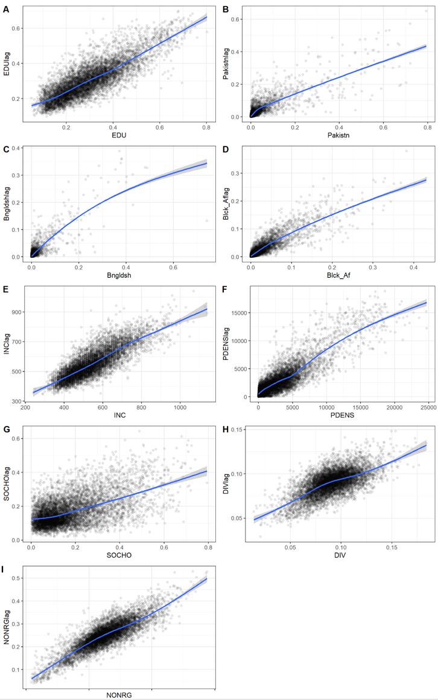

`r if(knitr:::is_latex_output()) '\\appendix'`

`r if(!knitr:::is_latex_output()) '# (APPENDIX) Appendix {-}'` 

# Appendix {-}


```{r appendix1, echo=FALSE, warning=FALSE }
library(knitr)    # For knitting document and include_graphics
library(read.so) # to read in .md files
library(kableExtra)
Appendix1 <- read.csv("figure/Appendix_1.csv")
kbl(Appendix1, booktabs = T, align = "c", escape = F, caption = "Appendix 1. Bivariate correlation and p-values.") %>%
    kable_styling(full_width = T, font_size = 9) %>%
  add_footnote("*** P<0.001; ** p<0.01; * p <0.05", notation = "none") %>%
    add_footnote("Source: ONS, own calculations.", notation = "none")
```

```{r appendix2, warnings=FALSE, messages=FALSE, fig.cap="Appendix 2. Spatial autocorrelation of explanatory variables. Source: ONS, own calculations.", out.width = "95%", echo=FALSE, warning=FALSE}
# All defaults
library(knitr)    # For knitting document and include_graphics
library(captioner)
library(ggplot2)  # For plotting
library(png)

```


```{r appendix3, echo=FALSE, warning=FALSE }
library(knitr)    # For knitting document and include_graphics
library(read.so) # to read in .md files
library(kableExtra)
appendix3 <- read.csv("figure/Appendix_3.csv")
colnames(appendix3) <- c(" ", '$e^b$', '$e^b$*SE', '$e^b$', '$e^b$*SE','$e^b$', '$e^b$*SE')
kbl(appendix3, booktabs = T, align = "c", escape = F, caption = "Appendix 3. Spatial Durbin Error Model. Direct, Indirect and Total Effects (unstandardised.") %>%
    kable_styling(full_width = T, font_size = 9) %>%
  add_footnote("Lambda: 0.381 (λ). LR test value: 538.9***. AIC: 2330.8.", notation = "none") %>%
    add_footnote("*** P<0.001; ** p<0.01; * p <0.05.", notation = "none") %>%
    add_footnote("Source: ONS, own calculations.", notation = "none") %>%
  add_header_above(c(" " = 1, "Direct effects" = 2, "Indirect effects" = 2, "Total effects" = 2))
```
